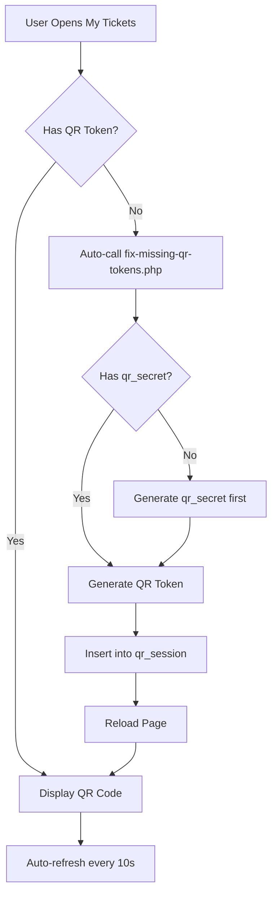

# QR Code Generation Fix - Troubleshooting Guide

## 🔴 Masalah yang Terjadi

Setelah upload project ke VPS, halaman **My Tickets** menampilkan error:
- **"QR Code generation failed"**
- Pesan: "Scan the QR code at parking entrance"
- Tombol "Refreshing in 5s" tidak berfungsi


---

## 🔍 Penyebab Masalah

### 1. **QR Token Tidak Ada di Database**
Booking yang dibuat sebelum sistem QR diimplementasikan tidak memiliki entry di tabel `qr_session`.

### 2. **Missing `qr_secret` Field**
Beberapa booking lama mungkin tidak memiliki `qr_secret` yang diperlukan untuk generate QR token.

### 3. **Database Schema Tidak Sinkron**
Database di VPS mungkin belum ter-update dengan schema terbaru yang include tabel `qr_session`.

---

## ✅ Solusi yang Diimplementasikan

### **1. Auto-Fix QR Token** ✨

Sistem sekarang akan **otomatis** memperbaiki QR token yang hilang saat halaman dimuat.

#### File yang Diupdate:
- **`api/fix-missing-qr-tokens.php`** (NEW) - API endpoint untuk fix QR tokens
- **`pages/my-ticket.php`** - Auto-fix on page load + manual button

#### Cara Kerja:
1. Saat halaman `my-ticket.php` dimuat, sistem cek apakah booking punya QR token
2. Jika **tidak ada**, sistem otomatis memanggil `fix-missing-qr-tokens.php`
3. API akan:
   - Generate `qr_secret` jika belum ada
   - Create entry baru di tabel `qr_session`
   - Generate QR token yang valid
4. Halaman reload otomatis dan QR code muncul

### **2. Manual Fix Button** 🔘

Jika auto-fix gagal, user bisa klik tombol **"Generate QR Code"** untuk manual trigger.

### **3. Regenerate Button on Error** 🔄

Jika QR code gagal di-load, muncul tombol **"Regenerate QR Code"** untuk retry.

---

## 📋 Langkah Deploy ke VPS

### **Step 1: Upload File Baru**

Upload file berikut ke VPS:

```bash
# Via SCP/SFTP
scp api/fix-missing-qr-tokens.php user@your-vps:/path/to/spark/api/
scp pages/my-ticket.php user@your-vps:/path/to/spark/pages/
```

### **Step 2: Verify Database Schema**

SSH ke VPS dan pastikan tabel `qr_session` ada:

```bash
ssh user@your-vps
docker exec -it spark-db-1 mysql -u root -p
```

```sql
USE spark;
SHOW TABLES LIKE 'qr_session';
DESCRIBE qr_session;
```

Expected output:
```
+------------+----------+------+-----+-------------------+
| Field      | Type     | Null | Key | Default           |
+------------+----------+------+-----+-------------------+
| id_qr      | int(11)  | NO   | PRI | NULL              |
| id_booking | int(11)  | NO   | MUL | NULL              |
| qr_token   | char(64) | NO   |     | NULL              |
| expires_at | datetime | NO   |     | NULL              |
| created_at | timestamp| NO   |     | CURRENT_TIMESTAMP |
+------------+----------+------+-----+-------------------+
```

### **Step 3: Test Fix**

1. Buka halaman My Tickets di browser
2. Jika QR token hilang, sistem akan auto-fix dalam 1 detik
3. Halaman akan reload dan QR code muncul

---

## 🧪 Testing Checklist

- [ ] Halaman My Tickets bisa dibuka tanpa error
- [ ] QR code muncul untuk active booking
- [ ] Auto-refresh QR code setiap 10 detik
- [ ] Countdown timer berjalan dengan benar
- [ ] Tombol "Generate QR Code" berfungsi jika QR hilang
- [ ] Tombol "Regenerate QR Code" muncul jika QR error

---

## 🐛 Troubleshooting

### **QR Code Masih Tidak Muncul**

1. **Check Browser Console**
   ```javascript
   // Buka Developer Tools (F12) > Console
   // Cari error message
   ```

2. **Check Server Logs**
   ```bash
   docker logs spark-web-1 --tail 50
   ```

3. **Manual Test API**
   ```bash
   curl -X POST "http://your-vps-ip:8080/api/fix-missing-qr-tokens.php?booking_id=1" \
        -H "Cookie: PHPSESSID=your-session-id"
   ```

### **Database Connection Error**

Check `.env` file di VPS:
```bash
cat /path/to/spark/.env
```

Pastikan:
- `DB_HOST=db` (bukan localhost)
- `DB_NAME=spark`
- `DB_USER=root`
- `DB_PASS=rootpassword`

### **Permission Error**

```bash
# Set correct permissions
chmod 644 api/fix-missing-qr-tokens.php
chmod 644 pages/my-ticket.php
chown www-data:www-data api/fix-missing-qr-tokens.php
chown www-data:www-data pages/my-ticket.php
```

---

## 📝 Technical Details

### **QR Token Generation Flow**



### **Database Schema**

```sql
-- qr_session table
CREATE TABLE IF NOT EXISTS `qr_session` (
  `id_qr` int(11) NOT NULL AUTO_INCREMENT,
  `id_booking` int(11) NOT NULL,
  `qr_token` char(64) NOT NULL,
  `expires_at` datetime NOT NULL,
  `created_at` timestamp NOT NULL DEFAULT current_timestamp(),
  PRIMARY KEY (`id_qr`),
  KEY `id_booking` (`id_booking`),
  CONSTRAINT `qr_session_ibfk_1` FOREIGN KEY (`id_booking`) 
    REFERENCES `booking_parkir` (`id_booking`)
) ENGINE=InnoDB DEFAULT CHARSET=utf8mb4;
```

---

## 🎯 Summary

**Masalah:** QR code tidak muncul di halaman My Tickets setelah deploy ke VPS

**Root Cause:** Booking tidak punya entry di tabel `qr_session`

**Solusi:**
1. ✅ Auto-fix QR token on page load
2. ✅ Manual "Generate QR Code" button
3. ✅ Regenerate button on error
4. ✅ Handle missing `qr_secret` field

**Status:** ✅ **FIXED**

---

## 📞 Support

Jika masalah masih terjadi setelah mengikuti guide ini:
1. Check browser console untuk error messages
2. Check server logs: `docker logs spark-web-1`
3. Verify database schema dengan query di atas
4. Test API endpoint secara manual dengan curl

**Last Updated:** 2026-01-06
